<div align="center">

# ⚡ GridSync
### Combined Cycle Power Plant — Net Output Predictor

[](https://pytorch.org)
[](https://gradio.app)
[](https://scikit-learn.org)
[](https://python.org)
[](https://huggingface.co/spaces/KARTHIKAKRISHNA123/GridSync)
[](LICENSE)

**A production-grade ANN regression pipeline that predicts net electrical energy output (PE) of a combined cycle power plant from 4 ambient environmental parameters — deployed on Hugging Face Spaces with zero infrastructure overhead.**

</div>

---

## 📌 Problem Statement

Combined Cycle Power Plants (CCPP) integrate gas turbines, steam turbines, and heat recovery to maximize energy conversion efficiency. Net electrical output (PE) is highly sensitive to ambient conditions — temperature, vacuum pressure, atmospheric pressure, and humidity — all of which vary hour by hour.

**This system answers:** *Given current environmental sensor readings, what net power output (MW) will the plant generate?*

Accurate prediction enables grid operators to balance load, plan maintenance windows, and optimize dispatch — reducing both waste and cost.

---

## 🎯 Solution Overview

GridSync wraps a trained PyTorch regression ANN inside a Gradio Blocks interface. Users set 4 environmental sliders (bounded by real CCPP dataset min/max values) and receive an instant power output prediction with a visual load bar and operating-level classification.

The model was trained with best-checkpoint saving — only the epoch with the lowest validation MSE is persisted as `gridsync_model.pth`.

---

## ✨ Key Features

| Feature | Detail |
|---|---|
| **Regression output** | Continuous MW prediction (operating range: 420 – 496 MW) |
| **4 input parameters** | AT (temperature), V (vacuum), AP (pressure), RH (humidity) |
| **Visual load bar** | `█░░` unicode bar showing % of rated operating range |
| **Load classification** | High / Medium / Low load level label |
| **Data-grounded sliders** | Min/max/default derived from 9,568-sample CCPP dataset |
| **Best-model checkpoint** | `best_model.pt` saved at lowest validation MSE epoch |
| **Industrial dark-teal UI** | Grid-monitoring aesthetic; 4-card stat header |

---

## 🏗️ Overall Architecture

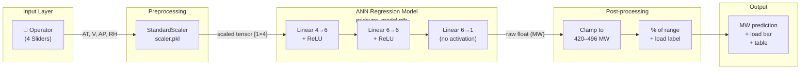

---

## 🧠 System Architecture

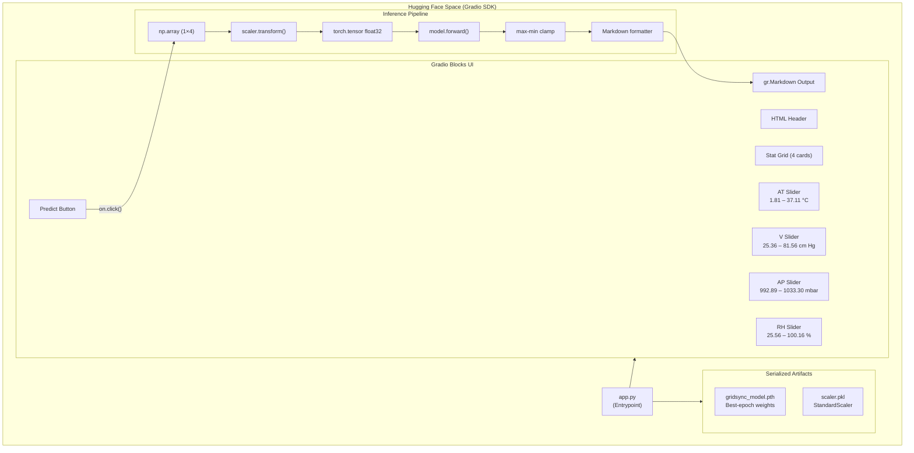

---

## 🧰 Technology Stack — Complete Breakdown

| Technology | Version | Category | Purpose in Project | Why Chosen | Key Features Used |
|---|---|---|---|---|---|
| **PyTorch** | 2.x | Deep Learning | ANN regression model definition, training, and inference | Dynamic graph, `state_dict` portability, best-checkpoint save pattern | `nn.Module`, `nn.Sequential`, `nn.Linear`, `nn.ReLU`, `nn.MSELoss`, `optim.Adam`, `model.eval()`, `torch.no_grad()`, `torch.save()`, `torch.load()` |
| **torch.nn** | — | Model API | Layered MLP architecture for regression | Sequential API enables clean serialization and loading | `nn.Sequential`, `nn.Linear(4,6)`, `nn.Linear(6,6)`, `nn.Linear(6,1)`, `nn.ReLU` |
| **torch.optim** | — | Optimization | Adam optimizer for weight updates | Adaptive learning rate; converges faster than SGD on tabular data | `optim.Adam(model.parameters())` |
| **scikit-learn** | 1.x | Preprocessing | Feature standardization of AT, V, AP, RH | Zero-mean unit-variance improves gradient flow in early layers | `StandardScaler.fit_transform(X_train)`, `StandardScaler.transform(X_test)` |
| **joblib** | — | Serialization | Persist fitted `scaler.pkl` for inference reuse | Efficient numpy-array serialization, preferred over pickle for sklearn | `joblib.dump()`, `joblib.load()` |
| **NumPy** | 1.x | Numerical | Construct input array from slider values | Bridge between Python float → sklearn scaler → PyTorch tensor | `np.array([[at,v,ap,rh]], dtype=np.float32)` |
| **pandas** | 2.x | Data I/O | Load and split `powerplant_data.csv` during training | DataFrame-native train/test split with `.values` to numpy | `pd.read_csv()`, `df.drop()`, `y.values` |
| **Gradio** | 4.x | UI / Serving | Blocks layout with sliders and markdown output | Native HF Spaces SDK; `gr.Markdown` for rich formatted predictions | `gr.Blocks`, `gr.Slider`, `gr.Markdown`, `gr.Button`, `gr.Row`, `gr.HTML`, `gr.themes.Base`, CSS |
| **Gradio Themes** | — | Design | Industrial dark-teal colour tokens | Energy domain requires precision and authority — cold teal achieves this | `gr.themes.colors.teal`, `gr.themes.colors.cyan`, `gr.themes.GoogleFont` |
| **Matplotlib** | 3.x | Visualization | Training/validation loss curve during notebook analysis | Quick plot of train vs val MSE over 100 epochs | `plt.plot()`, `plt.legend()` — training only, not in inference |

---

## 📊 Dataset Overview

| Property | Value |
|---|---|
| **Source** | UCI ML Repository — Combined Cycle Power Plant |
| **File** | `powerplant_data.csv` |
| **Rows** | 9,568 hourly samples |
| **Features** | AT, V, AP, RH (4 environmental sensors) |
| **Target** | PE — Net Electrical Energy Output (MW) |
| **Train / Test split** | 80 / 20, `random_state=42` |

### Feature Statistics

| Feature | Description | Min | Mean | Max |
|---|---|---|---|---|
| **AT** | Ambient Temperature (°C) | 1.81 | 19.65 | 37.11 |
| **V** | Exhaust Vacuum (cm Hg) | 25.36 | 54.31 | 81.56 |
| **AP** | Ambient Pressure (mbar) | 992.89 | 1013.26 | 1033.30 |
| **RH** | Relative Humidity (%) | 25.56 | 73.31 | 100.16 |
| **PE** | Net Power Output (MW) | 420.26 | 454.37 | 495.76 |

---

## 🔄 Request Lifecycle

### Prediction Request — User Sets Environmental Conditions

```
1. USER INTERACTION
   └── User adjusts 4 Gradio sliders (AT, V, AP, RH)
       → Clicks "⚡ Predict Net Power Output"
       → btn.click(fn=predict, inputs=[at, v, ap, rh], outputs=output)

2. PYTHON FUNCTION CALL
   └── predict(at, v, ap, rh) invoked with 4 float arguments

3. PREPROCESSING
   └── np.array([[at, v, ap, rh]], dtype=np.float32)
       → shape: (1, 4)
       → scaler.transform(arr)   [StandardScaler from scaler.pkl]
       → output: (1, 4) zero-mean unit-variance

4. TENSOR CONVERSION
   └── torch.tensor(arr_scaled, dtype=torch.float32)
       → shape: [1, 4]

5. FORWARD PASS
   └── model.eval() + torch.no_grad()
       → Linear(4→6) + ReLU
       → Linear(6→6) + ReLU
       → Linear(6→1)           [raw float — no activation on output]
       → model(tensor).item()  [Python float]

6. POSTPROCESSING
   └── clamped  = max(420.0, min(496.0, output))
       → pct    = (clamped - 420.0) / 76.0 * 100
       → bar_str = "█" × int(pct/5) + "░" × remaining
       → load_label = High / Medium / Low

7. OUTPUT RENDER
   └── Markdown string with:
       - ## {MW} headline
       - Unicode bar + percentage
       - Table: raw prediction / range / load level
       → gr.Markdown renders in HF Space
```

---

## 🌊 Data Flow Explanation

```
Training Phase (Notebook)              Inference Phase (HF Space)
────────────────────────────           ─────────────────────────────
powerplant_data.csv                    Gradio sliders (AT, V, AP, RH)
         │                                          │
  pd.read_csv()                         np.array([[at,v,ap,rh]])
         │                                          │
  X = [AT,V,AP,RH], y = [PE]           shape: (1, 4) float32
         │                                          │
  train_test_split (80/20)              scaler.transform()     ← scaler.pkl
         │                                          │
  StandardScaler.fit_transform(X_train) scaled tensor [1, 4]
         │                                          │
  TensorDataset + DataLoader(batch=32)  model.forward()        ← gridsync_model.pth
         │                                          │
  ANN.forward() + MSELoss               raw float (MW)
         │                                          │
  Adam.step() × 100 epochs              clamp(420, 496)
         │                                          │
  if val_loss < best:                    pct-of-range + bar_str
    torch.save(state_dict)               │
         │                               gr.Markdown output
  joblib.dump(scaler)
```

---

<details>
<summary>📐 UML Diagram Suite — All 9 Diagrams</summary>

### 1. Use Case Diagram

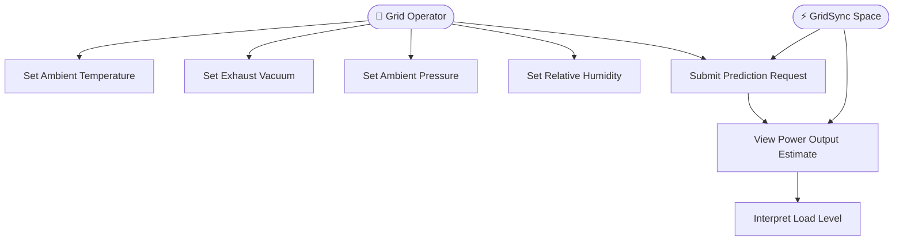

### 2. Class Diagram

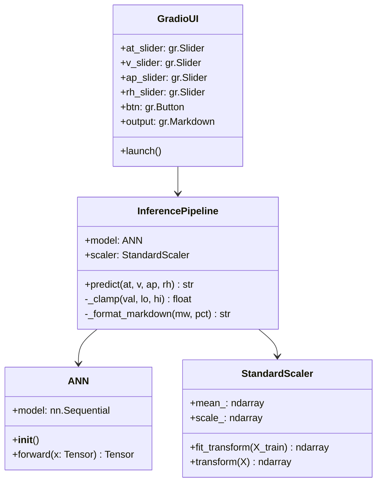

### 3. Sequence Diagram

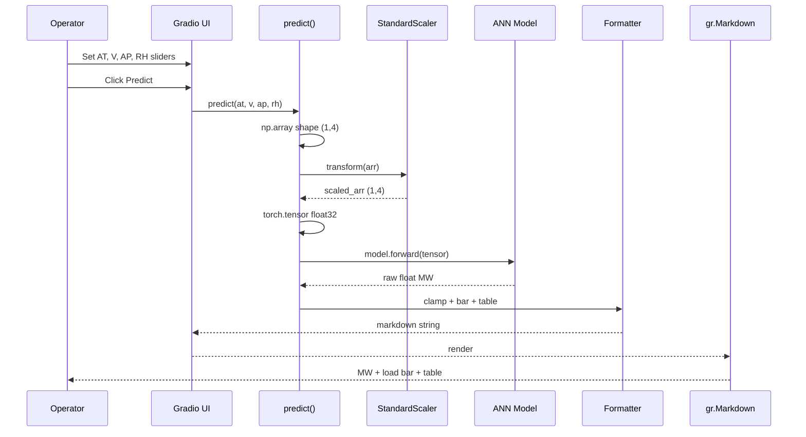

### 4. Activity Diagram

```mermaid
flowchart TD
    A([Start]) --> B[User opens HF Space]
    B --> C[Stat cards load: 9568 samples, 420-496 MW range]
    C --> D[User adjusts 4 environment sliders]
    D --> E[Click Predict Net Power Output]
    E --> F[predict() invoked]
    F --> G[np.array constructed 1x4]
    G --> H[StandardScaler transforms]
    H --> I[FloatTensor created]
    I --> J[ANN forward pass]
    J --> K[Raw float extracted .item()]
    K --> L[Clamp to 420-496 MW]
    L --> M[Compute pct of range]
    M --> N[Build unicode bar and load label]
    N --> O[Format markdown string]
    O --> P[gr.Markdown renders]
    P --> Q([Operator reads MW estimate])
```

### 5. Component Diagram

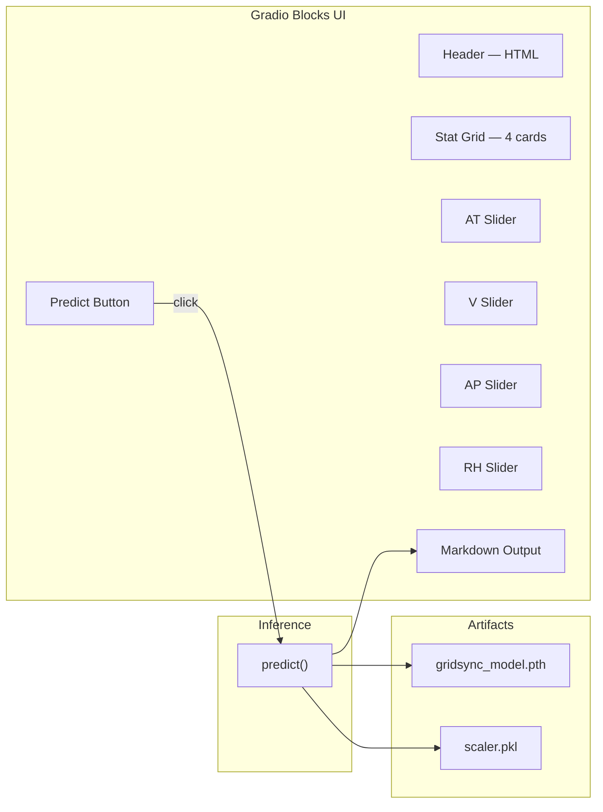

### 6. Deployment Diagram

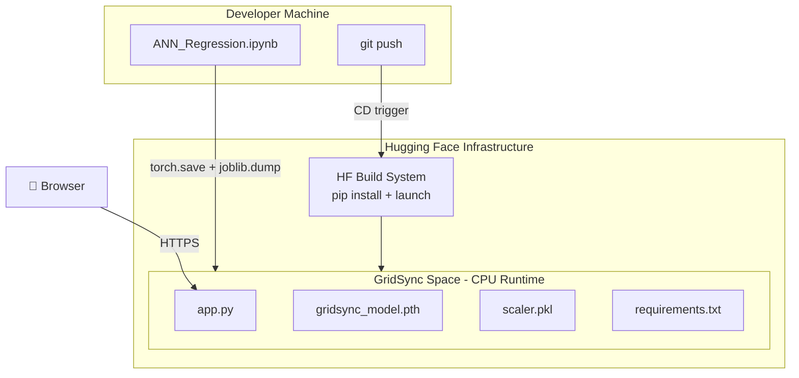

### 7. State Diagram

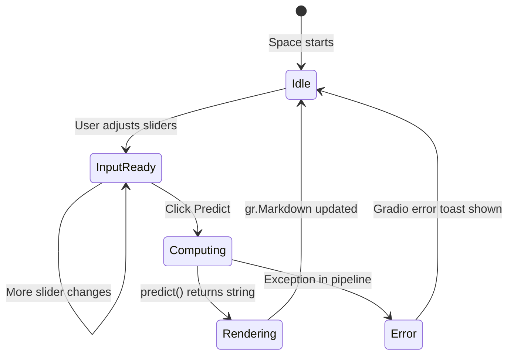

### 8. Object Diagram

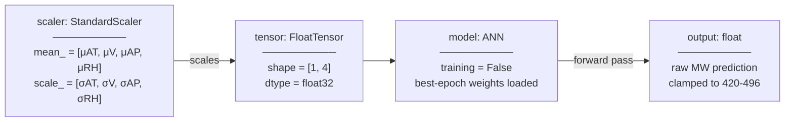

### 9. Package Diagram

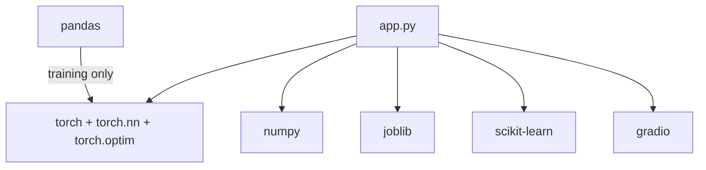

</details>

---

<details>
<summary>📊 Data Flow Diagrams — L0 and L1</summary>

### DFD Level 0 — Context Diagram

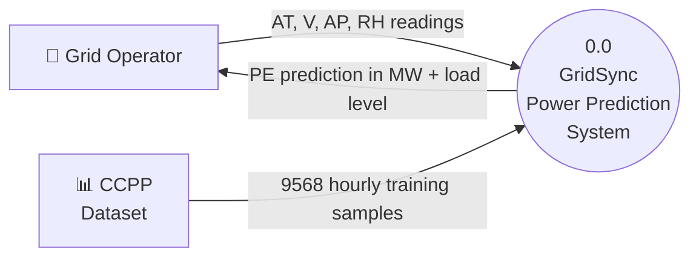

### DFD Level 1 — System Processes

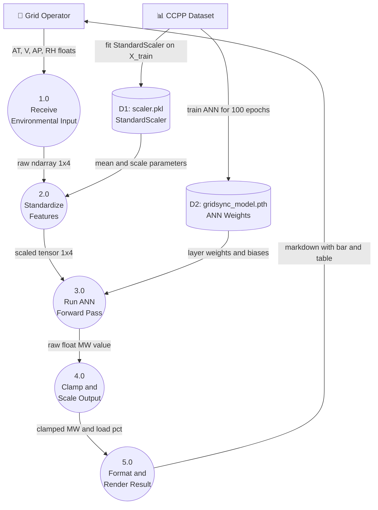

</details>

---

## 📁 Folder Structure

```
GridSync/                            ← HF Space root (cloned repo)
├── app.py                           ← Entrypoint: ANN class + predict() + Gradio UI
├── requirements.txt                 ← Runtime dependencies
├── gridsync_model.pth               ← Best-checkpoint ANN weights (lowest val MSE)
├── scaler.pkl                       ← Fitted StandardScaler for AT, V, AP, RH
└── README.md                        ← This file (HF Space card + documentation)
```

---

## ⚙️ Prerequisites

- Python 3.10+
- Git with [Git LFS](https://git-lfs.github.com/) (for `.pth` files > 10MB)
- Hugging Face account + `huggingface_hub` CLI

---

## 🚀 Local Installation

```bash
# 1. Clone the Space
git clone https://huggingface.co/spaces/KARTHIKAKRISHNA123/GridSync
cd GridSync

# 2. Install dependencies
pip install -r requirements.txt

# 3. Confirm artifacts exist
ls gridsync_model.pth scaler.pkl

# 4. Launch
python app.py
# → Opens at http://localhost:7860
```

---

## 🏋️ Training Artifacts — How to Export from Notebook

The notebook already saves `best_model.pt` during training. After training completes, rename and export:

```python
import joblib

# best_model.pt is already saved by the training loop
# Rename to match app.py expectation
import os
os.rename("best_model.pt", "gridsync_model.pth")

# Export scaler
joblib.dump(scaler, "scaler.pkl")

print("✅ Artifacts ready: gridsync_model.pth, scaler.pkl")
```

Move both files into the cloned HF Space directory before `git push`.

---

## 🧪 Inference Pipeline Internals

```python
# What predict() does step by step
arr        = np.array([[at, v, ap, rh]], dtype=np.float32)  # (1, 4)
arr_scaled = scaler.transform(arr)                            # (1, 4) standardized
tensor     = torch.tensor(arr_scaled, dtype=torch.float32)   # FloatTensor [1, 4]

with torch.no_grad():
    output = model(tensor).item()     # raw float — no activation on output layer

clamped = max(420.0, min(496.0, output))          # safety clamp to dataset range
pct     = (clamped - 420.0) / (496.0 - 420.0) * 100
```

---

## 📦 Dependencies

```
torch          — ANN architecture, weight loading, tensor ops
numpy          — input array construction
scikit-learn   — StandardScaler for feature normalization
joblib         — scaler serialization and loading
gradio         — Blocks UI, sliders, markdown output, HF Spaces serving
pandas         — CSV loading during training (not required at inference)
```

---

## 🚀 Deployment

```bash
cd GridSync/

git add app.py requirements.txt gridsync_model.pth scaler.pkl README.md
git commit -m "feat: initialize GridSync inference engine"
git push
# HF dashboard: Building → Running
```

> **Git LFS** — if `gridsync_model.pth` exceeds 10MB:
> ```bash
> git lfs install
> git lfs track "*.pth" "*.pkl"
> git add .gitattributes
> ```

---

## 🔒 Security Considerations

- All inputs are bounded sliders derived from dataset min/max — no string injection surface
- Model runs on CPU; no sensitive data persisted between requests
- Artifacts are read-only at inference time

---

## ⚡ Performance

| Metric | Value |
|---|---|
| Inference latency | < 20ms on CPU |
| Model parameters | ~115 (4×6 + 6×6 + 6×1 + biases) |
| Memory footprint | < 100KB |
| Training samples | 9,568 |
| Best-epoch checkpoint | Saved at lowest validation MSE |

---

## 👩‍💻 Author

**Karthika Krishna M**  
B.E. Computer Science & Engineering  
Anna University Regional Campus, Tirunelveli  
Co-founder, Niranthara · AI/ML Engineer  

[](https://github.com/KARTHIKAKRISHNA123)
[](https://huggingface.co/KARTHIKAKRISHNA123)

---

## 📄 License

MIT License — see [LICENSE](LICENSE) for details.